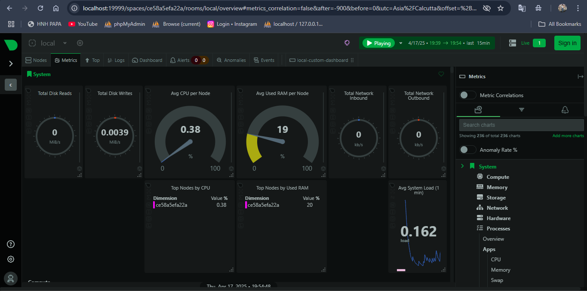
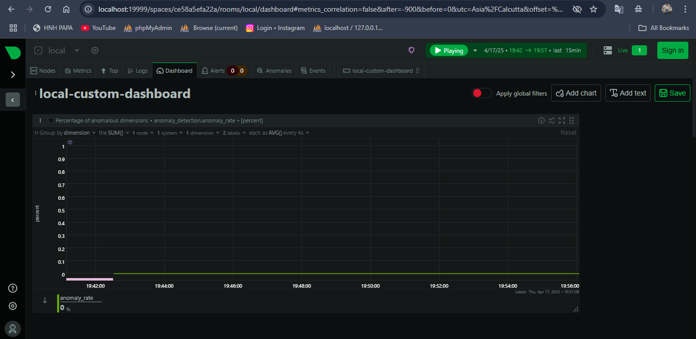

# NetData
# 📊 Task 7: Monitor System Resources Using Netdata

This project demonstrates how to monitor your system and Docker container metrics using **Netdata**, a powerful real-time monitoring tool.

---

## ✅ Objective

- Install and run Netdata using Docker
- Visualize CPU, memory, disk, and container performance
- Explore the dashboard and real-time charts

---

## 🔧 Prerequisites

- Docker installed and running (WSL 2 enabled if using Windows)
- Internet connection to pull Netdata image

---

## 🚀 Steps to Run Netdata with Docker

1. **Start Docker Desktop** and ensure it is running.

2. **Run Netdata Container:**

   ```bash
   docker run -d --name=netdata \
     -p 19999:19999 \
     --cap-add=SYS_PTRACE \
     --security-opt=apparmor=unconfined \
     netdata/netdata
    ```


## 📸 Screenshots



